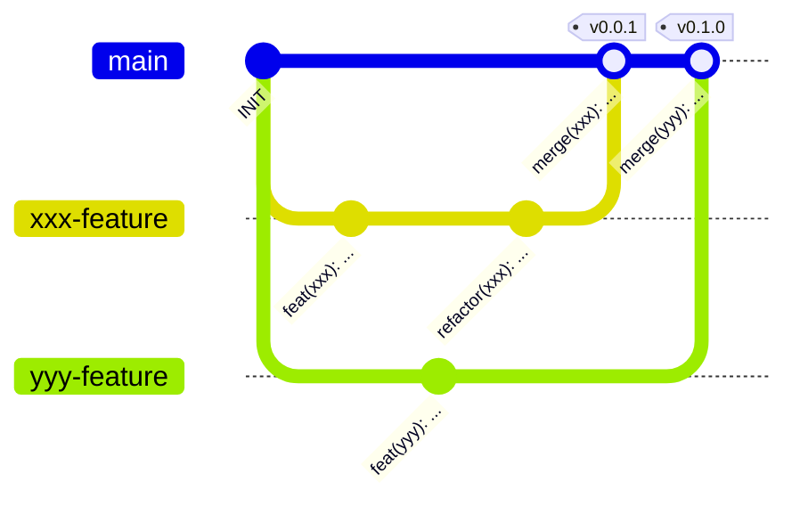

# Contribution Guidelines

## Commitlint

We use the conventional commit style guides to allow an easy release cycle.
Based on this commit message style semantic-releases will be created.
Therefore, it is important to adhere to the guidelines.

### Conventional Commit Messages

> [!TIP]
> [https://www.conventionalcommits.org/en/v1.0.0/](https://www.conventionalcommits.org/en/v1.0.0/)

**Commit Message**

```text
type(scope): subject  # 1

...                   # 2

BREAKING CHANGE: ...  # 3
```

1. [Header](#commit_header)
2. [Body](#commit_body)
3. [Breaking Changes](#commit_breaking_changes)

#### Header

The header always consists of three mandatory fields with max. **72** characters:

1. type
    * What type of commit? `feat`, `ci`, `build`, `fix`, `style`, `docs`, `refactor`, `revert`, `chore`, `wip`, `perf`
    * Single lower-case word
2. scope
    * List of modified components
    * Words are always _kebab-case_
3. subject
    * Summary of work

<details>
<summary>Standard Commit Types</summary>

|     Type | Description                                           |
|---------:|:------------------------------------------------------|
|     feat | new feature added                                     |
|    style | apply code style changes                              |
|    build | apply changes to build scripts (CMake, Gradle, Bazel) |
|       ci | apply changes to workflows                            |
|      fix | fix bugs with adding features                         |
|     docs | add documentation                                     |
| refactor | apply code refactorings                               |
|   revert | undo earlier code changes                             |
|    chore | remove old/unused code fragments/files                |

</details>

> [!TIP]
> Types and Scopes for the project are defined inside a file in the projects root-directory called `.commitlintrc.js`.

#### Body [optional]

The Body can give a more detailed subscription of the changes accomplished with this commit and offer an explanation
why these changes maybe required in the first place.

#### Breaking Changes [optional]

This field has to be added, when the commit has changes that impact pre-existing source code that can lead to
conflicts with other parts or projects, e.g.

* Changes to public APIs
* Changes to method behaviour that has impacts on users
* ...

### Semantic Releases

[Semantic-release](https://semantic-release.gitbook.io/semantic-release) is a tool used to generate our release tags,
based on conventional commit messages.
This tool scans the latest commit messages and increases the three fields of the release version accordingly.

**Release Tag**

```text
v.MAJOR.MINOR.PATCH
```

* **Major/Breaking Release**: Increased on commits with `BREAKING CHANGE` field
* **Minor/Feature Release**  Increased on commits of type `feat`
* **Patch/Fix Release** Increased on commits of type `fix`

## Github-Workflow

> [!NOTE]
> * Push your modification to a new feature branch based of the `main` branch
> * Open a pull request to the `main` branch
> * The maintainer of the repository can then merge your source code contributions

> [!IMPORTANT]
> **Do not push directly to the `main` branch**

<details>
<summary>Example Git Workflow</summary>



</details>

####  Developer Workflow

1. Branch out from `main`
2. Commit your source code contributions
    * Make Sure that your contributions follow our code/commit standards
3. Create Pull-Request to `main`
4. Wait for Required tests to finish
5. Apply Changes if necessary
6. Done 🎉

## Code Style

### Naming Scheme

|        Scope | Scheme               | Remarks                 |
|-------------:|:---------------------|:------------------------|
|        Files | PascalScheme         |                         |
|    Functions | camelCase            |                         |
|    Variables | camelCase            | suffix: typedef => `_t` |
| Preprocessor | SCREAMING_SNAKE_CASE |                         |

Functions and global variables should be prefixed with a consistent identifier, e.g.the file name where the function
prototype resides.
