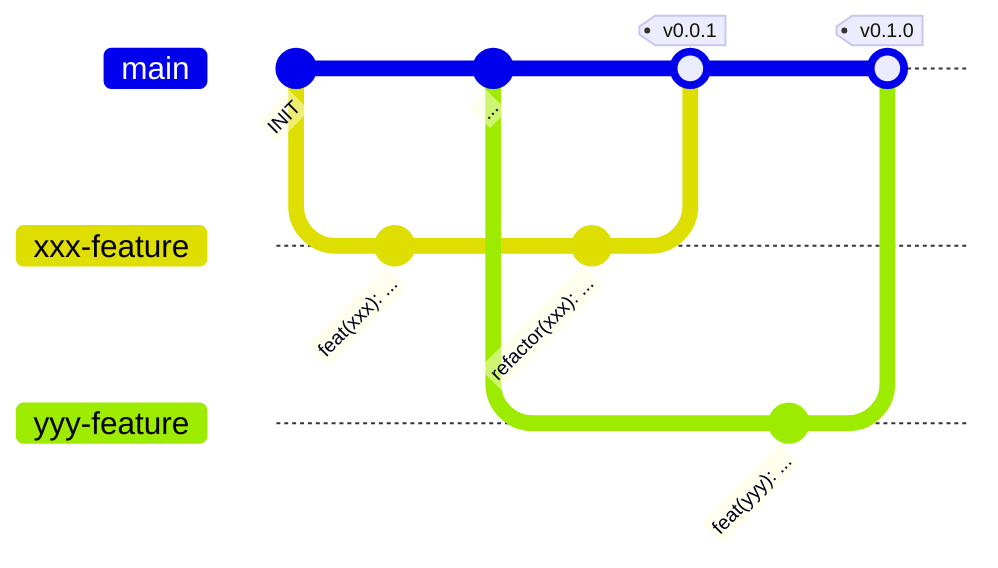

# Contribution guidelines

## Commitlint

We use the conventional commit style guides to allow an easy release cycle.
Based on this commit message style semantic-releases will generated.
Therefore, it is important to adhere to the guidelines.

### Conventional commit messages

> [!TIP]  
> [https://www.conventionalcommits.org/en/v1.0.0/](https://www.conventionalcommits.org/en/v1.0.0/)

**Commit Message:**

```text
type(scope): subject  # 1

...                   # 2

BREAKING CHANGE: ...  # 3
```

1. [Header](#header)
2. [Body](#body)
3. [Breaking Changes](#breaking-changes)

#### Header

The header always consists of three fields with max. **72** characters:

1. type
   - One of:
     - `feat`
     - `ci`
     - `build`
     - `fix`
     - `style`
     - `docs`
     - `refactor`
     - `revert`
     - `chore`
     - `wip`
     - `perf`
   - Words are _lower-case_
2. scope (optional)
   - Describes the modified part
   - Words are _kebab-case_
3. subject
   - Short summary of work

<details>
<summary>Standard Commit Types</summary>

|     Type | Description                                           |
| -------: | :---------------------------------------------------- |
|     feat | new feature added                                     |
|    style | apply code style changes                              |
|    build | apply changes to build scripts (CMake, Gradle, Bazel) |
|       ci | apply changes to workflows                            |
|      fix | fix bugs with adding features                         |
|     docs | add documentation                                     |
| refactor | apply code refactorings                               |
|   revert | undo earlier code changes                             |
|    chore | remove old/unused code fragments/files                |

</details>

<details>
<summary>Standard Commit Scopes</summary>

|    Scope | Description                                                  |
| -------: | :----------------------------------------------------------- |
|      hal | Hardware Abstraction Layer (freertos, spi, i2c, sleep, ...)  |
|   sensor | Sensor Libraries (adxl345b, sht3x, ...)                      |
|  network | Network related Libraries (esp, http, mqtt, ...)             |
|     fpga | FPGA related Libraries (fpga, middleware, stub, ...)         |
|    flash | Flash related Libraries (flash, filesystem, ...)             |
| protocol | Protocol related Libraries (usb-protocol, eai-protocol, ...) |

</details>

#### Body

The Body can give a more detailed subscription of the changes accomplished
with this commit and offer an explanation
why these changes are required in the first place.

#### Breaking changes

When the commit has changes that impact pre-existing source code
that can lead to conflicts with other parts or projects, e.g.

- Changes to public APIs
- Changes to method behaviour that impacts users

this field is added.

## Semantic releases

Semantic release is the concept used to generate our release tags.
The tool scans the latest commit messages and increases the
three fields of the release version accordingly.

**Release Tag:**

```text
v.MAJOR.MINOR.PATCH
```

- **Major/Breaking Release**: Increased on commits with `BREAKING CHANGE` field
- **Minor/Feature Release** Increased on commits of type `feat`
- **Patch/Fix Release** Increased on commits of type `fix`

## GitHub workflow

> [!NOTE]
>
> - Push your modification to a new feature branch based of the `main` branch
> - Open a pull request to the `main` branch
> - The maintainer of the repository can then merge your source code contributions

<details>
<summary>Example Git Workflow</summary>



</details>

> [!IMPORTANT]
> **Do not push directly to the `main` branch**

### Developer workflow

1. Branch out from `main`
2. Commit your source code contributions
   - Make Sure that your contributions follow our code/commit standards
3. Create Pull-Request to `main`
4. Wait for Required tests to finish
5. Apply Changes if necessary
6. Done 🎉

## Code style

### Naming scheme

|        Scope | Scheme               | Remarks                 |
| -----------: | :------------------- | :---------------------- |
|        Files | PascalScheme         |                         |
|    Functions | camelCase            |                         |
|    Variables | camelCase            | suffix: typedef => `_t` |
| Preprocessor | SCREAMING_SNAKE_CASE |                         |

Functions and global variables have prefixes with a consistent identifier,
e.g. the file name where the function prototype belongs to.
