# enV5 Remote Control Protocol

In this file the communication protocol is explained.

The communication is driven by the external device to determine the elasticNodes behavior.
The communication protocol is as follows. For each communication an ack or nack is sent by the receiver.
As a default we recommend to throw an error after 5 failed attempts.

The byteorder for number conversion is big endian.

This protocol only works with skeleton V2.

## Transmission

**Transmission**

| command | payload-size |      payload |      checksum |
|--------:|-------------:|-------------:|--------------:|
| 1 bytes |      4 bytes | payload-size | Checksum-size |

## Checksum-function

1 byte XOR over all command + payload-size + payload bytes

## Commands

The first 128 are our commands.
The second 128 can be user specific commands.

**Commands**

|                  command | uint8 |
|-------------------------:|:------|
|                     nack | 0     |
|                      ack | 1     |
|         read skeleton id | 2     |
| get chunk-size for flash | 3     |
|       send data to flash | 4     |
|     read data from flash | 5     |
|               FPGA power | 6     |
|                FPGA LEDs | 7     |
|                 MCU LEDs | 8     |
|      inference with data | 9     |

### nack

The payload for the nack response is empty

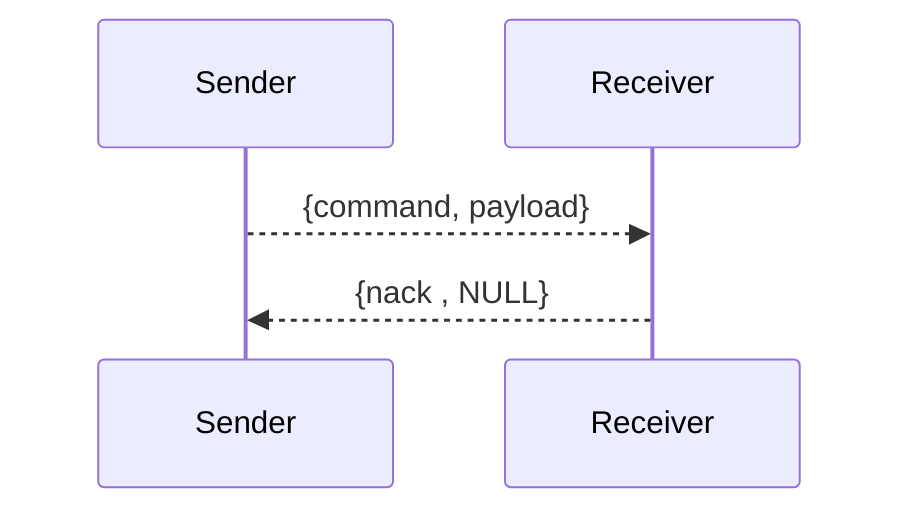

### ack

The payload for the ack response is empty

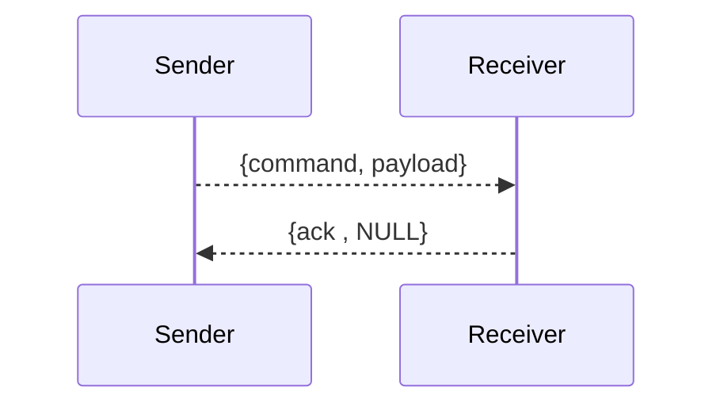

### read skeleton id

**❗ IMPORTANT**\
Model needs to be deployed in advance.

The payload for the nack response is empty

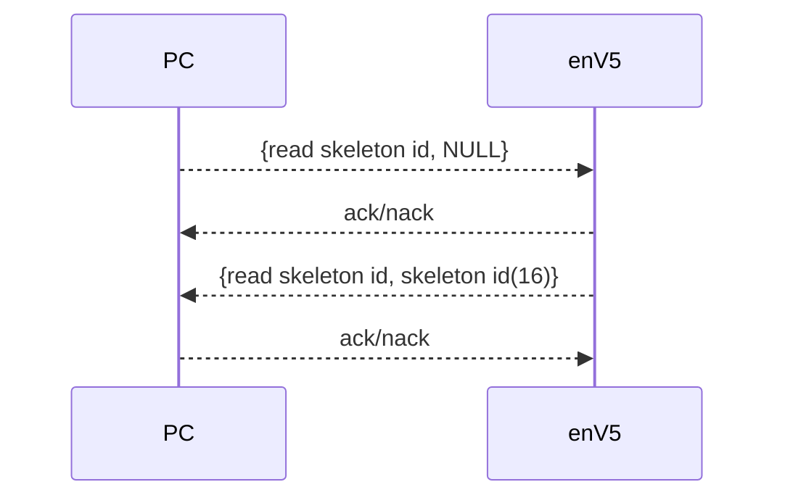

### get chunk-size for flash

**Payload**

| chunk-size |
|------------|
| 31-0       |

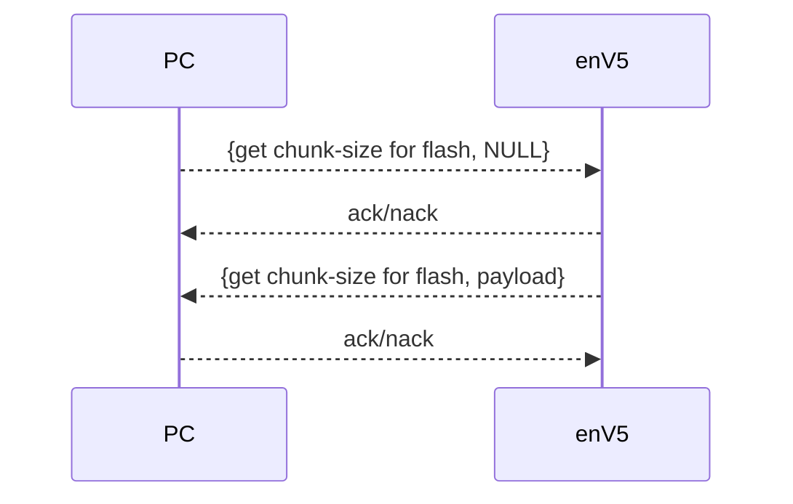

### send data to flash

**❗ IMPORTANT**\
Chunk-size has to be requested in advance.

**❗ IMPORTANT**\
Turn off FPGA in advance.

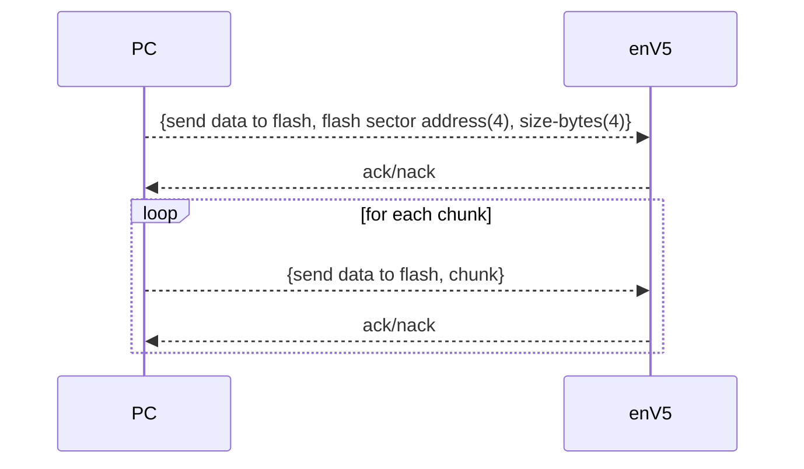

### read data from flash

**❗ IMPORTANT**\
Chunk-size has to be requested in advance.

**❗ IMPORTANT**\
Turn off FPGA in advance.

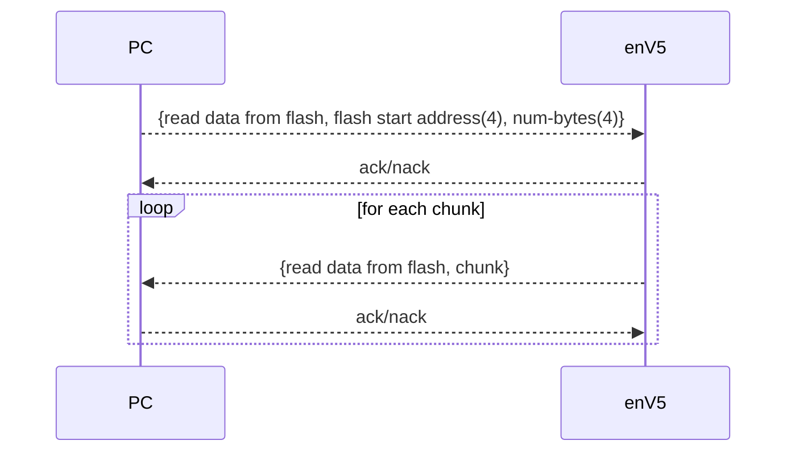

### FPGA power

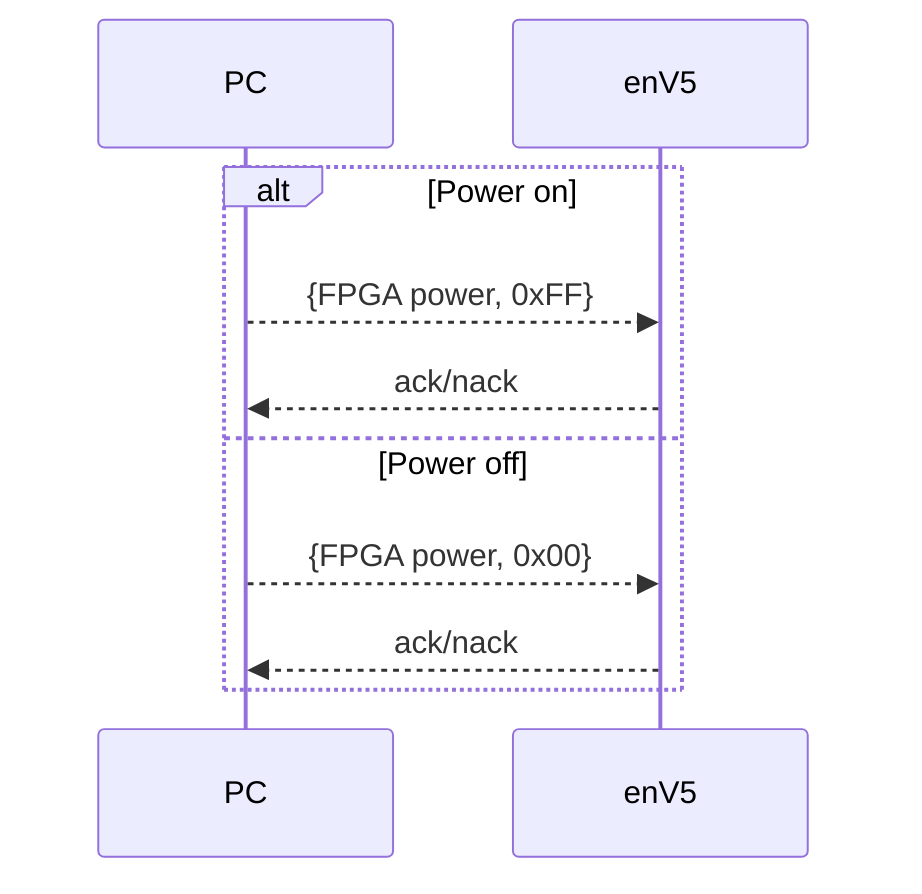

### FPGA LEDs

**Payload**

| Bit | FPGA LED |
|----:|:---------|
| 7-4 | None     |
|   3 | 4        |
|   2 | 3        |
|   1 | 2        |
|   0 | 1        |

Mermaid Diagram

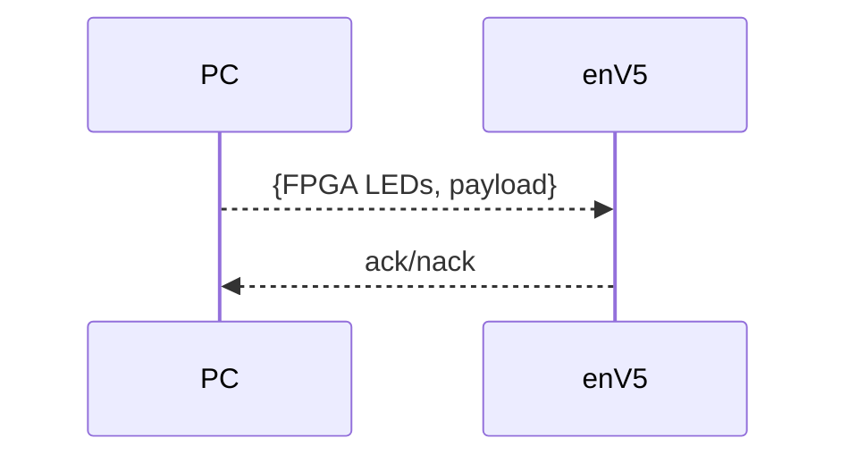

### MCU LEDs

**Payload**

| Bit | MCU LED |
|----:|:--------|
| 7-3 | None    |
|   2 | 3       |
|   1 | 2       |
|   0 | 1       |

Mermaid Diagram

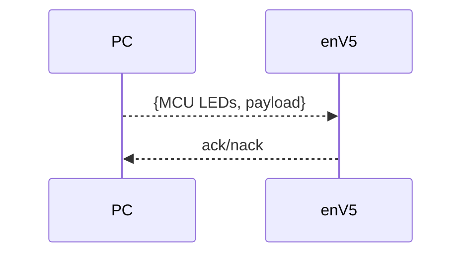

### inference with data

**❗ IMPORTANT**\
Chunk-size has to be requested in advance.

**❗ IMPORTANT**\
Deploy model in advance

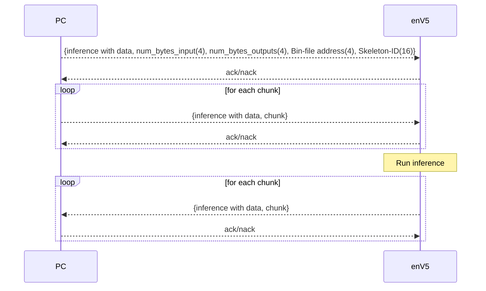

### deploy model

**❗ IMPORTANT**\
Chunk-size has to be requested in advance.

**❗ IMPORTANT**\
Model needs to be send to flash in advance.

**❗ IMPORTANT**\
FPGA needs to be turned on.

**payload**

| Bit | Payload    |
|----:|:-----------|
| 7-1 | None       |
|   0 | true/false |

Payload is true if models skeleton id is correct. Otherwise, false is returned

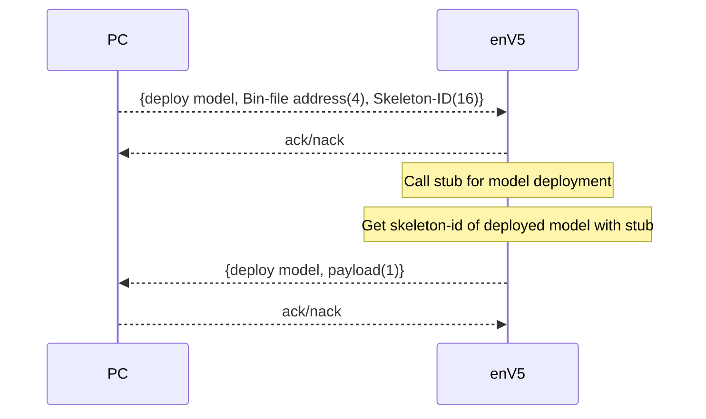
