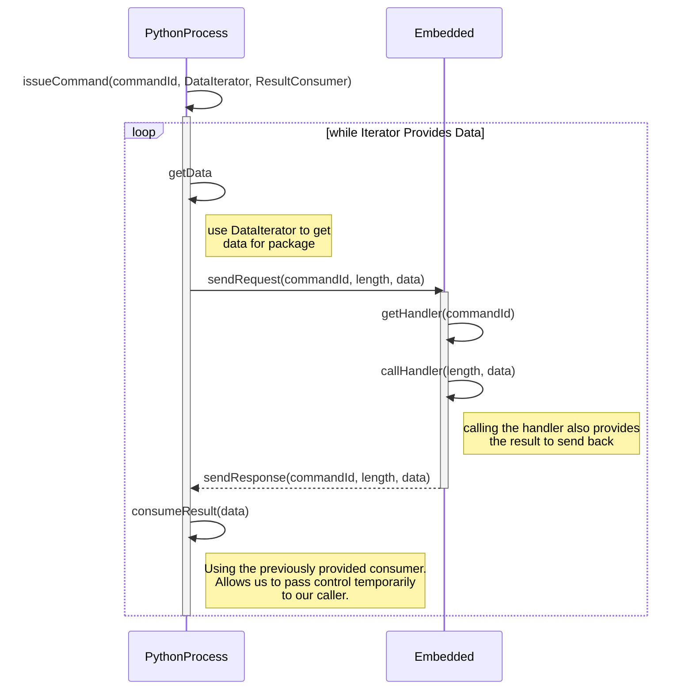

# Experiment Protocol Design

**Endianness**:  endianness is command dependent

## Draft 0

```mermaid
sequenceDiagram
  PythonProcess->>PythonProcess: issueCommand(commandId, DataIterator, ResultConsumer)
  activate PythonProcess
  loop while Iterator Provides Data
  PythonProcess->>PythonProcess: getData
  Note right of PythonProcess: use DataIterator to get<br> data for package
  PythonProcess->>Embedded: sendRequest(commandId, length, data)
  activate Embedded
  Embedded ->> Embedded: getHandler(commandId)
  Embedded ->> Embedded: callHandler(length, data)
  Note right of Embedded: calling the handler also provides <br> the result to send back
  Embedded -->> PythonProcess: sendResponse(commandId, length, data)

  deactivate Embedded

  PythonProcess ->> PythonProcess: consumeResult(data)
  Note right of PythonProcess: Using the previously provided consumer.<br>Allows us to pass control temporarily<br>to our caller.
  end

  deactivate PythonProcess
```

The embedded system is expected to answer with the same command id that was used to send the request