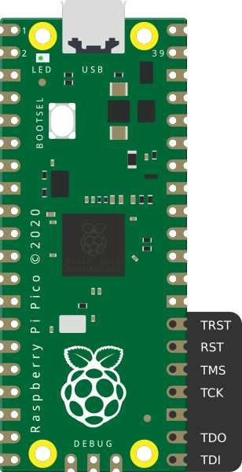
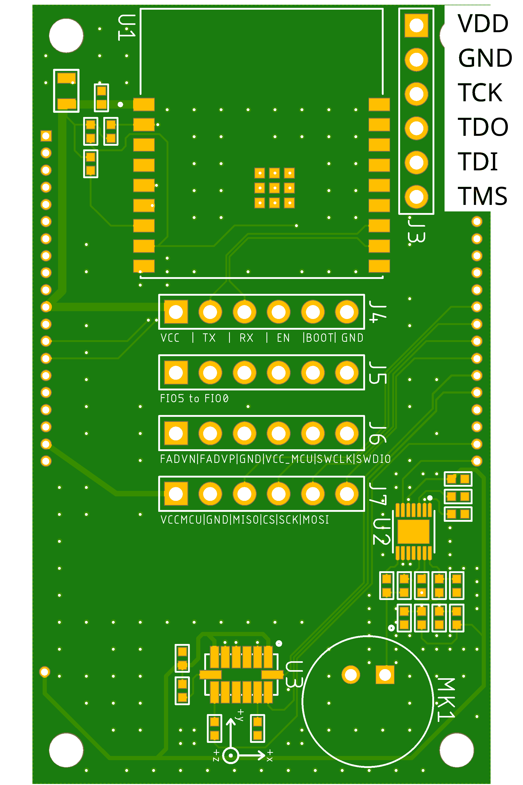

# Vivado Debugger

## Starting Vivado

1. Go to Vivado installation directory (`cd ...`)
2. Run `source settings64.sh`
3. Run `vivado`

## Connect debugger

### Setup

> [!IMPORTANT]
> JTAG cable for FPGA required

1. Connect both USB cables (FPGA JTAG and USB-C enV5)
2. Power on FPGA (type "P" in minicom)
3. Open Vivado Hardwaremanager and connect Debugger
   1. Open Vivado
   2. Click "Open Hardwaremanager"
   3. Click "Open Target" and "Autoconnect"
4. Right-click Device and "Add Configuration Memory Device"
5. Search for `fl128` and select
   `s25fl128sxxxxxx1-spiInstance-x1_x2_x4`

> [!TIP]
>
> **XVC-Pico**
>
> Instead of a
> [Digilent JTAG Debugger](https://digilent.com/shop/jtag-hs2-programming-cable/)
> you can also use a Raspberry Pico in combination with [XVC-Pico](https://github.com/kholia/xvc-pico)
>
> <details>
>   <summary>Pin Association:</summary>
>   
>   
> </details>

### Write to flash

1. Right-click the memory configuration Device and
   "Program Memory Configuration Device"
2. Select the `.bin` file to upload
3. Click the "MCU RST" Button on the device to power on the MCU

### Read from flash

1. Right-click memory configuration Device and
   "Readback from Memory Configuration Device"
2. Choose "BIN" as file format
3. When deselecting the "Address" Box you can
   - Apply an Offset to start the read back (hex encoded)
   - Specify the number of bytes you want to read back (hex encoded)

> [!TIP]
>
> To get the length of your file, use:
>
> ```bash
>   du -b <yourFile.bin>
> ```
>
> Convert the output into a hexadecimal number,
> so you can use it for the "Datacount" field

### How To verify the read-out data

1. Use the `xxd` program to convert `.bin` files into `.hex` files.
2. Use the `diff` program to compare the `.hex` files with each other

Convert the `.bin` against which to compare the read-out!

> [!NOTE]
>
> **enV5_top_reconfig.bin**
>
> 1. Flash via HTTP or USB
> 2. Readback from device
>    - The file is about 0x2AD10 Bytes Large. Put this number into the
>      "Datacount" field
>    - Choose "BIN" file as output format
> 3. Convert source `.bin` file and the `readback.bin` file into hex
>    files using `xxd`
> 4. Compare them using `diff <source.bin> <readback.bin>`
>
> There should not be any diff shown. If so, the writing is correct,
> otherwise the date written to the flash is corrupted during write!

## TCL commands

- TCL Commands are used to write a script that automates e.g. the read back process.
  These TCL Commands are in the TCL Console in Vivado, after reading back a file.

## FAQ

### How to install drivers for JTAG cables (if missing)

[Download Drivers](https://support.xilinx.com/s/question/0D52E00007BsRFTSA3/cable-drivers-not-working-for-users-that-didnt-install-them?language=en_US)

```bash
cd /tools/Xilinx/Vivado/2023.2/data/xicom/cable_drivers/lin64/install_script/install_drivers
sudo /tools/Xilinx/Vivado/2023.2/data/xicom/cable_drivers/lin64/install_script/install_drivers
sudo chmod 644 /etc/udev/rules.d/52-xilinx-digilent-usb.rules
```

### ERROR: [Labtools 27-2269]

- Make sure the MCU is powered on
- Make sure FPGA is powered on ⇒ "P" in minicom

```bash
cd .../tools/Xilinx/Vitis_HLS/2023.2
sudo apt update && sudo apt install -y libtinfo-dev
sudo ln -s /lib/x86_64-linux-gnu/libtinfo.so.6 /lib/x86_64-linux-gnu/libtinfo.so.5
```
